## System Architecture Blueprint

### App Summary

**App Name:** GoOut Hyd
**Domain:** goouthyd.in
**End Goal:** Help independent cafe owners in Hyderabad fill tables and generate event revenue by giving them a managed digital presence, while giving customers aged 20-35 a single place to discover cafes and live experiences across the city.
**Template Foundation:** rag-simple (Next.js 15, Supabase, Drizzle ORM, Tailwind CSS, Vercel)
**Required Extensions:** Email notifications (Resend), spam prevention (honeypot), Supabase Storage for images. No AI, no payments, no auth in Phase 1.

---

## System Architecture

### Template Foundation

**Chosen Template:** rag-simple
**Built-in Capabilities:**

- Next.js 15 App Router with React 19 and TypeScript 5 (strict mode)
- Supabase integration (server client, admin client, middleware, auth infrastructure)
- Drizzle ORM 0.44.6 with migration tooling (generate, migrate, rollback, seed, studio)
- Tailwind CSS 3.4.1 with shadcn/ui component library
- Drizzle-Zod for type-safe schema validation
- Environment variable validation via @t3-oss/env-nextjs
- Vercel deployment configuration
- ESLint and TypeScript strict checking

**What Gets Stripped:**

- All RAG code (document upload, embeddings, vector search, AI chat)
- All AI dependencies (@ai-sdk/google, @google-cloud/aiplatform, etc.)
- All 6 existing database tables and 5 existing enums
- Python rag-processor application
- Stripe payment integration
- Protected routes and auth-gated UI

**What Gets Kept:**

- Supabase server/admin client setup
- Drizzle ORM connection and migration workflow
- Middleware structure (updated for public-only routes)
- Environment validation (updated to remove AI/GCP vars)
- All shadcn/ui components
- Root layout with font and metadata configuration
- Vercel deployment pipeline

### Architecture Diagram

```mermaid
graph TB
    %% ============================================================
    %% User Interface Layer
    %% ============================================================
    subgraph UI["User Interface Layer"]
        direction LR
        LANDING["Landing Page<br/>(/)"]:::userInterface
        CAFES_LIST["Cafe Listing<br/>(/cafes)"]:::userInterface
        CAFE_PROFILE["Cafe Profile<br/>(/cafes/[slug])"]:::userInterface
        EVENTS_LIST["Events Listing<br/>(/events)"]:::userInterface
        EVENT_DETAIL["Event Detail<br/>(/events/[slug])"]:::userInterface
        PARTNER["Partner Form<br/>(/partner)"]:::userInterface
        STATIC["About / Privacy / Terms"]:::userInterface
    end

    %% ============================================================
    %% Application Layer - Template Foundation
    %% ============================================================
    subgraph APP_FOUND["Application Layer - Template Foundation"]
        ROUTER["Next.js 15 App Router<br/>(Server-Side Rendering)"]:::backend
        SUPABASE_CLIENT["Supabase Server Client"]:::backend
        DRIZZLE["Drizzle ORM<br/>Query Layer"]:::backend
        MIDDLEWARE["Route Middleware<br/>(Public Routes Only)"]:::backend
        METADATA["Next.js Metadata API<br/>(SEO + Static OG Images)"]:::backend
        NEXTIMG["Next.js Image Component<br/>(Optimized Delivery)"]:::backend
    end

    %% ============================================================
    %% Application Layer - Extensions
    %% ============================================================
    subgraph APP_EXT["Application Layer - Extensions"]
        SERVER_ACTION["Server Action<br/>(submitPartnerForm)"]:::backend
        VALIDATION["Zod Schema Validation<br/>+ Honeypot Spam Filter"]:::backend
        EMAIL_SERVICE["Resend Email Service<br/>(Lead Notification to Wilson)"]:::backend
    end

    %% ============================================================
    %% Data Layer
    %% ============================================================
    subgraph DATA["Data Layer - PostgreSQL via Supabase"]
        CAFES_T["cafes<br/>(profiles, slugs, areas)"]:::database
        IMAGES_T["cafe_images<br/>(photo gallery per cafe)"]:::database
        MENU_T["menu_items<br/>(highlights per cafe)"]:::database
        EVENTS_T["events<br/>(tied to cafes, typed)"]:::database
        LEADS_T["cafe_leads<br/>(partner form submissions)"]:::database
    end

    %% ============================================================
    %% Storage Layer
    %% ============================================================
    subgraph STORAGE["Storage Layer"]
        SUPABASE_STORAGE["Supabase Storage<br/>(Public Bucket - Cafe/Event Images)"]:::storage
    end

    %% ============================================================
    %% External Services
    %% ============================================================
    subgraph EXTERNAL["External Services"]
        RESEND["Resend API<br/>(100 free emails/day)"]:::external
        VERCEL_ANALYTICS["Vercel Analytics<br/>(Page Views + Web Vitals)"]:::external
    end

    %% ============================================================
    %% Deployment
    %% ============================================================
    subgraph DEPLOY["Deployment"]
        VERCEL["Vercel<br/>(Production + Preview Deploys)"]:::frontend
    end

    %% ============================================================
    %% Connections - Page Render Flow (Read-Only)
    %% ============================================================
    LANDING & CAFES_LIST & CAFE_PROFILE & EVENTS_LIST & EVENT_DETAIL & STATIC -->|"Server Components"| ROUTER
    MIDDLEWARE -->|"Route Protection"| ROUTER
    METADATA -->|"SEO Meta Tags"| ROUTER
    ROUTER --> SUPABASE_CLIENT --> DRIZZLE
    DRIZZLE --> CAFES_T & IMAGES_T & MENU_T & EVENTS_T

    %% ============================================================
    %% Connections - Partner Form Flow (Write)
    %% ============================================================
    PARTNER -->|"Form Submit"| SERVER_ACTION
    SERVER_ACTION --> VALIDATION
    VALIDATION -->|"Valid Lead"| DRIZZLE
    DRIZZLE --> LEADS_T
    SERVER_ACTION -->|"On Success"| EMAIL_SERVICE
    EMAIL_SERVICE -->|"API Call"| RESEND

    %% ============================================================
    %% Connections - Image Delivery
    %% ============================================================
    NEXTIMG -->|"Public URLs"| SUPABASE_STORAGE

    %% ============================================================
    %% Connections - Deployment
    %% ============================================================
    VERCEL -->|"Hosts"| ROUTER
    VERCEL_ANALYTICS -.->|"Auto-Tracking"| VERCEL

    %% ============================================================
    %% Styles
    %% ============================================================
    classDef userInterface fill:#1E88E5,stroke:#1565C0,stroke-width:2px,color:#fff
    classDef frontend fill:#42A5F5,stroke:#1976D2,stroke-width:2px,color:#fff
    classDef backend fill:#66BB6A,stroke:#388E3C,stroke-width:2px,color:#fff
    classDef database fill:#4CAF50,stroke:#2E7D32,stroke-width:2px,color:#fff
    classDef storage fill:#26A69A,stroke:#00695C,stroke-width:2px,color:#fff
    classDef external fill:#FF7043,stroke:#D84315,stroke-width:2px,color:#fff
```

### Extension Strategy

**Why Resend:** The only extension service needed. The partner form requires notifying Wilson when a cafe owner submits interest. Resend provides a simple API, generous free tier (100 emails/day, more than enough for early-stage leads), and excellent Next.js/TypeScript integration. No other email service offers this combination of simplicity and DX.

**Why Supabase Storage (Public Bucket):** Images are uploaded manually by the developer through the Supabase dashboard. Public bucket URLs served directly, no signed URL overhead. Next.js `Image` component handles optimization and lazy loading on the frontend. When traffic scales, Vercel's built-in image optimization sits between the browser and Supabase Storage with zero code changes.

**Why Honeypot over reCAPTCHA:** The partner form is the only write endpoint. A hidden honeypot field filters bots with zero user friction, zero dependencies, and zero cost. If spam becomes a real problem post-launch, Cloudflare Turnstile can be added in 30 minutes without rearchitecting.

**Avoided Complexity:**

- No Redis cache. 10-50 cafes and 20-100 events fit entirely in PostgreSQL with sub-100ms queries.
- No background job queue. Email sends are fast enough to run inline in the server action.
- No CDN layer. Supabase Storage + Next.js Image handles the image volume.
- No separate API routes. Server Components fetch data directly via Drizzle. Only the partner form uses a Server Action.
- No monitoring stack. Vercel Analytics and function logs cover MVP observability.
- No staging environment. Solo developer with manual data entry. Preview deployments test code changes against the production database safely.

### System Flow Explanation

**Page Render Flow (all read-only pages):**

- Browser requests a page (e.g., `/cafes/banjara-hills-blend`)
- Vercel routes to Next.js 15 App Router
- Server Component executes on the server
- Drizzle ORM query runs against Supabase PostgreSQL (e.g., fetch cafe by slug with images, menu items, and upcoming events)
- Next.js renders full HTML with SEO metadata and OG tags
- HTML returned to browser with images loaded via Next.js Image component from Supabase Storage public URLs
- Vercel Analytics auto-tracks the page view

**Partner Form Flow (only write operation):**

- Customer fills the partner form on `/partner` (Client Component with controlled inputs)
- On submit, the form data hits a Next.js Server Action
- Server Action runs Zod validation (owner name, cafe name, phone, area)
- Honeypot check runs: if hidden field is filled, silently reject
- Valid data is inserted into `cafe_leads` table via Drizzle ORM
- Resend API sends a notification email to Wilson with the lead details
- Server Action returns success/error result
- Client shows success toast ("Thanks! Wilson will reach out within 24 hours") and resets the form

**Image Management Flow (developer only, pre-Phase 2):**

- Developer uploads images to Supabase Storage public bucket via the Supabase dashboard
- Developer copies the public URL and adds it to the relevant database row (cafe cover_image, cafe_images entries, or event cover_image)
- Frontend renders images using Next.js `Image` component with the public URL as `src`

**SEO and Social Sharing Flow:**

- Each page generates metadata via Next.js Metadata API
- Cafe profiles use cafe name, area, and description for meta tags
- Cover images are used directly as Open Graph images (static OG)
- Event pages include event name, date, cafe name, and event type in metadata
- Area-filtered pages get dynamic titles (e.g., "Cafes in Banjara Hills")

---

## Technical Risk Assessment

### Template Foundation Strengths (Low Risk)

- **Supabase + Drizzle ORM are production-proven.** The connection setup, migration workflow, and type inference chain (schema to Zod to TypeScript) all come from the template and are battle-tested.
- **Vercel + Next.js 15 deployment is zero-config.** Push to main, it deploys. Preview URLs on every PR. No Docker, no CI/CD to configure.
- **shadcn/ui eliminates component risk.** Every button, card, input, dropdown, and toast is already installed and styled. No custom component library to build and maintain.
- **No auth in Phase 1 removes an entire risk category.** No session management, no token refresh, no protected routes, no permission bugs. The middleware just passes everything through.

### Extension Integration Points (Monitor These)

- **Resend API reliability.** If Resend's API is down when a lead submits, the lead data is still saved to the database (insert happens before email send). Wilson just won't get notified instantly. Mitigation: the server action should catch email failures gracefully and still return success to the user. Wilson can check Supabase directly for new leads as a fallback.

- **Supabase Storage URL stability.** If images are deleted or the bucket configuration changes, cafe pages will show broken images. Mitigation: since the developer is the only person managing storage, this is a manual-error risk, not a system risk. Being careful with bucket management is sufficient. No automated cleanup or orphan detection needed at this scale.

- **Schema migration from RAG to GoOut Hyd.** Dropping all 6 existing tables and creating 5 new ones is a clean break. The risk is low because the production database has no real user data yet. But the migration must be tested on a fresh Supabase project before running against production. Run `npm run db:generate` and `npm run db:migrate` in sequence and verify all tables exist in Supabase dashboard.

### Smart Architecture Decisions

- **Server Components for all data fetching.** No client-side data fetching, no loading spinners, no race conditions. Every page arrives fully rendered. The only Client Component is the partner form (needs controlled inputs and toast).
- **Single write endpoint.** The partner form is the only mutation in the entire app. One Server Action, one Zod schema, one database insert, one email send. Minimal surface area for bugs.
- **No API routes.** Server Components call Drizzle directly. No REST API layer to design, document, or secure. This is the right call when you have zero external consumers of your data.
- **Display-only pricing.** Ticket prices stored as integers (whole rupees) and rendered as text. No payment processing, no currency conversion, no tax calculation. When Phase 2 adds Razorpay, the conversion to paise happens in the payment service layer, not the database.

---

## Implementation Strategy

### Phase 1 - Leverage Template Foundation

**Step 1: Strip RAG Code**

- Remove all RAG-specific dependencies from package.json
- Delete RAG components, API routes, lib files, and schema files
- Update environment validation to remove GCP/AI variables
- Update middleware for public-only routes
- Verify the app still boots cleanly with `npm run dev`

**Step 2: Build New Schema**

- Create 5 new schema files in `lib/drizzle/schema/` (cafes, cafe_images, menu_items, events, cafe_leads)
- Create 4 new enums (cafe_status, event_type, event_status, lead_status)
- Export all schemas from index.ts
- Run `npm run db:generate` then `npm run db:migrate`
- Seed 3-5 sample cafes with images, menu items, and events for development

**Step 3: Build Pages (one at a time)**

- Create Drizzle query functions in `lib/queries/` (cafes.ts, events.ts, areas.ts)
- Build cafe listing page with area filtering
- Build cafe profile page with images, menu, events, and contact info
- Build events listing page with category filtering
- Build event detail page with venue info
- Build partner page with form, validation, honeypot, and Resend integration
- Build landing page (depends on cafe and event queries being ready)
- Build static pages (about, privacy, terms)

**Step 4: Polish and Launch**

- Add SEO metadata to all pages via Next.js Metadata API
- Configure Supabase Storage public bucket and upload initial images
- Set up Resend account and verify sending domain
- Enable Vercel Analytics
- Seed production data (Wilson's initial cafes)
- Deploy to production and point goouthyd.in domain

### Phase 2 - Add Extensions When Needed

These extensions are NOT built in Phase 1 but the architecture supports adding them cleanly:

- **User authentication:** Re-enable Supabase Auth, add users table, protect new routes via middleware
- **Cafe owner dashboard:** New route group `app/(dashboard)/`, new Server Actions for CRUD operations on cafe data
- **Event ticketing:** Razorpay integration, tickets table, QR code generation service
- **WhatsApp CTA:** Add WhatsApp deep links to cafe profiles (frontend only, no backend service)
- **Dynamic OG images:** Add `@vercel/og` package, create OG image API route with branded templates
- **Staging environment:** Second Supabase project, environment-based config in Vercel
- **Error tracking:** Add Sentry SDK for runtime error monitoring

### Integration Guidelines

- **Resend is the only external API call in Phase 1.** It runs inside the partner form Server Action, after the database insert succeeds. If the email fails, catch the error, log it, and still return success to the user. The lead data is safe in the database regardless.
- **Supabase Storage is accessed via public URLs only.** No Supabase Storage SDK calls in application code. The developer uploads via dashboard, copies URLs, and stores them in database columns. The frontend renders them through Next.js `Image` component.
- **No API routes exist in Phase 1.** All data fetching happens server-side in Server Components via Drizzle ORM. If Phase 2 needs API routes (e.g., for a mobile app or external integrations), they can be added to `app/api/` without changing the existing Server Component architecture.

---

## Development Approach

### Template-First Development

- Start by stripping RAG code and verifying the app boots clean
- Leverage existing Drizzle migration workflow for schema changes
- Use existing shadcn/ui components for all UI elements
- Keep the Supabase client setup exactly as-is from the template
- Reuse the root layout structure (fonts, metadata, Toaster provider)

### Minimal Viable Extensions

- Resend is the only new dependency added in Phase 1
- Honeypot spam prevention is pure application logic (no external dependency)
- Vercel Analytics is auto-enabled (no code changes)
- Every other Phase 2 feature can be added without rearchitecting

### Build Order

- **Week 1, Days 1-2:** Strip RAG code, build schema, run migrations, seed data
- **Week 1, Days 3-4:** Cafe listing + cafe profile pages (the core experience)
- **Week 1, Days 5-6:** Events listing + event detail pages
- **Week 1, Day 7:** Partner form with Resend + landing page + static pages + SEO + launch

### One Page at a Time

Each page has a clear schema dependency and can be developed and tested independently:

- Cafe listing depends on: `cafes` table
- Cafe profile depends on: `cafes` + `cafe_images` + `menu_items` + `events` tables
- Events listing depends on: `events` + `cafes` tables (join for venue info)
- Event detail depends on: `events` + `cafes` tables
- Partner form depends on: `cafe_leads` table + Resend
- Landing page depends on: all queries being ready (build last)

---

## Success Metrics

This system architecture supports the core value proposition: **Give customers a reason to discover cafes, and give cafe owners a reason to get listed.**

**Template Optimization:** Leverages Next.js 15 SSR, Supabase PostgreSQL, Drizzle ORM type safety, shadcn/ui components, and Vercel deployment while adding only one external service (Resend)

**Focused Extensions:** Resend for lead notifications is the single addition. Everything else uses template foundation capabilities.

**Reduced Complexity:** 5 database tables, 1 Server Action, 1 external API call, 0 API routes, 0 auth flows, 0 payment flows. The entire Phase 1 application is read-heavy public content with a single write endpoint.

**Scalability Path:** The architecture cleanly supports Phase 2 additions (auth, dashboards, payments, ticketing) without rebuilding. Server Components, Drizzle queries, and the middleware structure all extend naturally.

> **Next Steps:** Ready for implementation. Start by stripping RAG code and building the new database schema, then build one page at a time following the build order above.
